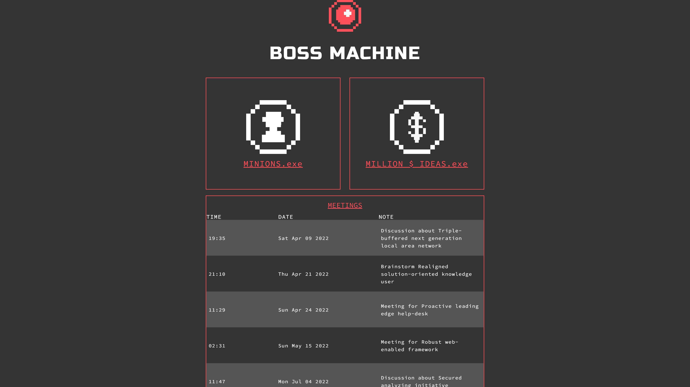

# Boss Machine

A web API, built with Express and Node.js, that stores and serves information to a Boss Machine, a unique management application for today's most accomplished (evil) entrepreneurs.

## Table of contents

* [General info](#general-info)
* [Screenshot](#screenshot)
* [Technologies](#technologies)
* [Languages](#languages)
* [Features](#features)
* [Inspiration](#inspiration)

## General info

 This is a challenge project set as part of the Codecademy Back-End Engineer career path course. It builds upon the skills acquired during the 'Build a backend with Node.js and Express' module of the course.

## Screenshot

## Technologies

* Node and Node Package Manager
* Git & GitHub
* Express
* HTML
* CSS
* React

## Languages

* JavaScript

## Features

The GUI allows users to:
* Manage Minions (Add, delete, view and update)
* Manage Ideas
* Manage Meetings

## Status

Project is: _COMPLETE_

## Inspiration

Project created as part of Codecademy Full-Stack Engineer career pathway.

